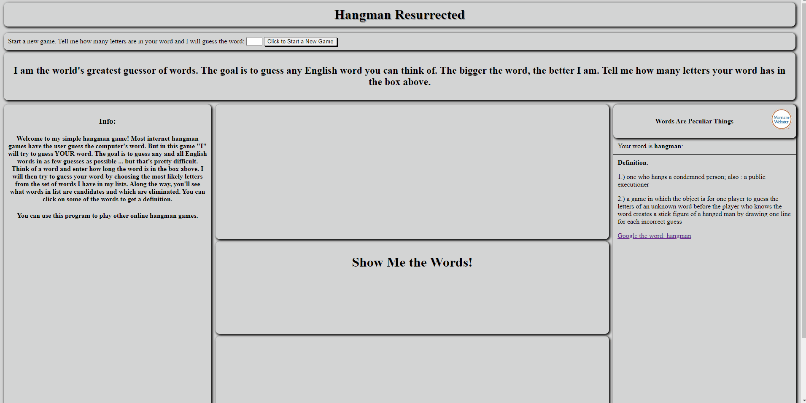

# Hangman-Resurrected-Javascript
Most online Hangman games have the user try to guess the the computer's word. This is a simple hangman game where the computer guesses YOUR word - or you can use it to solve the other hangman games on the internet. During the guessing portion the program gives estimates on how many errors it is likely to have until the word is guessed, and shows possible and eliminated words along with possible definitions for some along the way. At this time, this program runs fastest in Firefox and Microsoft Edge.

 

**Code Louisville Requirements met:**
* Read and parse an external file (such as JSON or CSV) into your application and display some data from that in your app. - I read two JSON files and display data from them. 
* Retrieve data from an external API and display data in your app (such as with fetch() or with AJAX) - I retrieve info from an online dictionary via Fetch.
* Create a dictionary or list, populate it with several values, retrieve at least one value, and use it in your program - I use several arrays and retrieve values from them. 
* Create and use a function that accepts two or more values, calculates or determines a new value based on those inputs, and returns a value - The user submits letter(s), empty spaces, and the length of the word all which start a chain of functions which calculates and returns possible words, a best guess, and estimation of errors.
* Analyze text and display information about it (ex: how many words in a paragraph) - The program provides statistics for large volumes of words (ex: how many words are candidates or are eliminated), determines the most frequent letters in sets of letters from candidate words-- and returns a guess, sums [ex: with .reduce()] estimations of errors and provides rough averages of expected errors per game as the game progresses.

**Dependencies/Instructions:**
* Download github repository to preferred directory
* Create an "api.js" file in the same directory as index.html and paste in the variable with the API key that is given to you and save
* Install Node.js
* Install http-server (https://www.npmjs.com/package/http-server)
    * In Node.js Command prompt type: npm install --global http-server
    * Once installed, type: http-server [directory], ex: http-server "C:\HangmanGame"
    * Once the server is started it will state the address: ex: http://127.0.0.1:8080
    * Copy the address into the address bar in your browser and it will open up the index.html
* Enjoy the hangman game

The user chooses a word and then tells the program how long the word is. The program reads and parses two JSON files (a smaller high frequency word list and a very large catch-most-all word list). It determines the frequency distrubution of letter sets within matching words and returns a guess to the user. The user then indicates where (or not where) that guess is in their word by entering the letter in the text box - or leaving it blank. When the user clicks submit, the text box values are used to determine possible candidate words, eliminated words, and the next guess which is presented to the user. The user can click on several words to possibly obtain a definition from Merriam-Webster's dictionary. (https://dictionaryapi.com/). After several series of guesses, the program will likely guess the user's word with relatively few errors. All the while, the program will present stats and estimations of errors along the way.

**Notes on word lists in JSON files:**
* I believe the list of words in hfWords.json originally was from a 5000 most frequently used word list. It may have been this website (https://www.wordfrequency.info/), but I cannot find the link to download again. In any case I removed about 700 words from the list. The words in bigWords.json were originally from https://github.com/dwyl/english-words, however I at some point merged this list with another and have also removed words that clearly weren't English as this larger list has many, many, "junk" words in it especially in the smaller words. This project builds on 2 other command line python projects involving word guessing. The "Errors" values are are taken from another project and are only estimations in this project.

* Of interest is a probability chart below of a different but similar dataset of words. The chart can be read as follows: 94% of 9 letter words (of which there were 57,346) would be guessed with 3 or fewer errors given a strategy of guessing the most frequently occuring letter. Although the word lists for this current program differ, the general trend of increasing accuracy with longer words remains. Smaller words with low frequency letters (ex: j,z,x) will have increased errors given this strategy.

 

**Some Features:**
* Validation of the user word length does not allow non numbers or numbers that don't correspond to a word in the word lists
* Validation of user input for each text box only allows lower case letters
* Dictionary API attempts to find a definition for a "random" word that is in the candidate word and that has the current letter being guessed
* Clicking on some words has the API attempt to find a definition, google search link is provided for words even when MW dictioanry can't provide definition
* Can click button to add the newest guess to an empty text box or enter manually
* Background color of game play area progressively moves from green to red with increase in errors
 
    
**Future Directions:**
* Have word lists stored on a server. The large word list contains many "junk" words and needs to be "cleaned". APIs or user input could help detect non words or add words not on the list (ex: pescatarian). This would move toward the goal of guessing all-and only all possible English words. Also, when junk words are removed, this will decrease the amount of errors needed to guess words of smaller lengths.
* Increase speed of processing when using the larger word list down to 1 second or less
 * Add a game state option to undo guesses which could reduce the size of the word list per search
* Improve look of application and UI
* Increase number of words - i.e. the program could guess a full sentence instead of a single word

