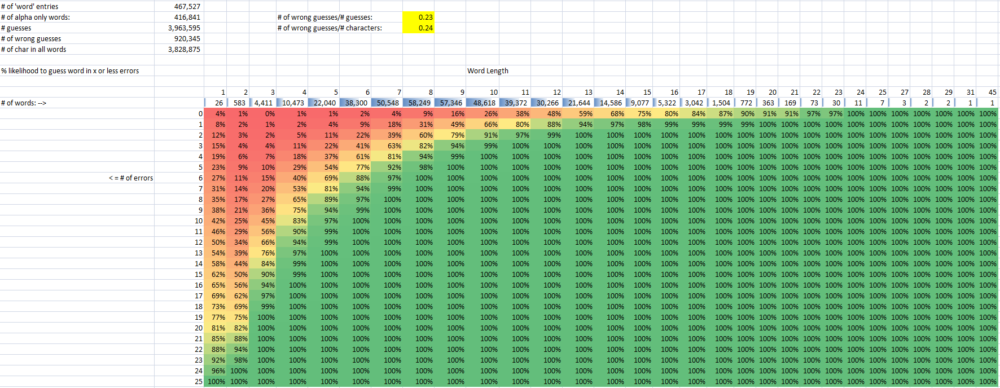

# Hangman-Resurrected-Javascript
Simple hangman game where the computer guesses your word, gives estimates on how many errors it is likely to have until the word is guessed, and shows possible and eliminated words along with possible definitions.

Code Louisville Requirements met:
* Read and parse an external file (such as JSON or CSV) into your application and display some data from that in your app. - I read two JSON files and display data from them. 
* Retrieve data from an external API and display data in your app (such as with fetch() or with AJAX) - I retrieve info from an online dictionary via Fetch.
* Create a dictionary or list, populate it with several values, retrieve at least one value, and use it in your program - I use several arrays and retrieve values from them. 
* Create and use a function that accepts two or more values, calculates or determines a new value based on those inputs, and returns a value - The user submits letters (or empty spaces) in various positions which starts a chain of functions which calculates possible words, a best guess, and estimation of errors.

The user chooses a word and then tells the program how long the word is. The program reads and parses two JSON files (a smaller high frequency word list and a very large catch all word list). It determines the frequency distrubution of letters within matching words and returns a guess to the user. The user then indicates where (or not where) that guess is in their word by entering the letter in the text box - or leaving it blank. When the user clicks submit the text box values are used to determine possible candidate words, eliminated words, and the next guess which is presented to the user. The user can click on several words to possibly obtain a definition from Merriam-Webster's dictionary. (https://dictionaryapi.com/). After several series of guesses, the program will likely guess the user's word with relatively few errors. All the while, the program will present stats and estimations of errors along the way.

Dependencies/Instructions:
* Download github repository to preferred directory
* Install Node.js
* Install http-server (https://www.npmjs.com/package/http-server)
    * In Node.js Command prompt type: npm install --global http-server
    * Once installed, type: http-server [directory], ex: http-server "C:\HangmanGame"
    * Once the server is started it will state the address: ex: http://127.0.0.1:8080
    * Copy the address into the address bar in your browser
* Create a "api.js" in the same directory as index.html and paste the API Key and save.
* Enjoy the hangman game

Notes on word lists in JSON files:
    I believe the list of words in hfWords.json originally was from a 5000 most frequently used word list. It may have been this website (https://www.wordfrequency.info/), but I cannot find the link to download again. In any case I removed about 700 words from the list. The words in bigWords.json were originally from https://github.com/dwyl/english-words, however I at some point merged this list with another and have also removed words that clearly weren't English as this larger list has many, many errors especially in the smaller words. This project is a combination of 2 other command line python projects. The "Errors" values are from are taken from another project and are only estimations.

    Of interest is an estimation chart below of a very similar dataset of words. The chart can be read as follows: 94% of 9 letter words (of which there were 57,346) would be guessed with 3 or fewer errors given a strategy of guessing the most frequently occuring letter. Although the word lists for this current program are slightly different, the general trend of increasing accuracy with longer words remains.

 

    
Future Directions:
* Add a game state option to undo guesses.
* Have word lists stored on a server. API or user input could help detect non words or add words not on the list. This would move toward the goal of guessing all-and only all of possible English words.